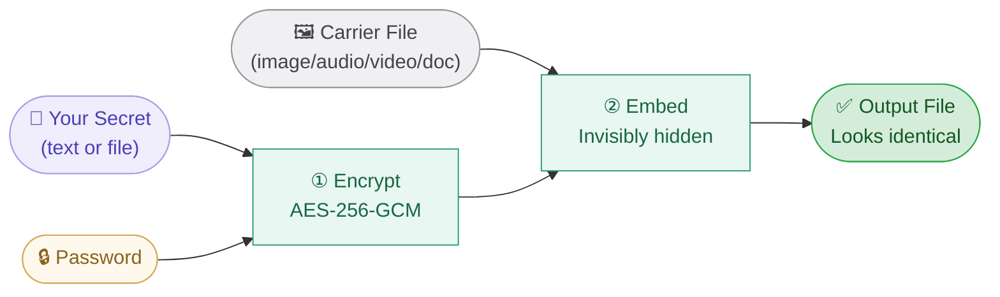
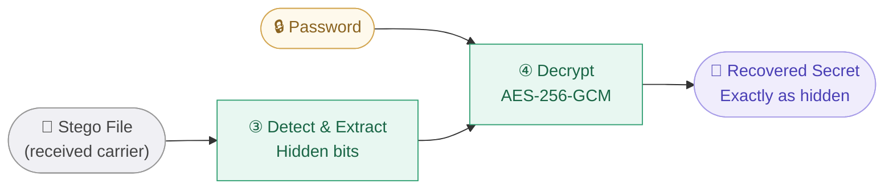
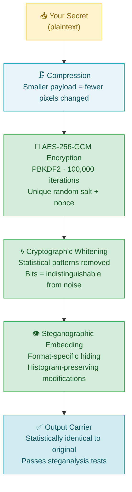
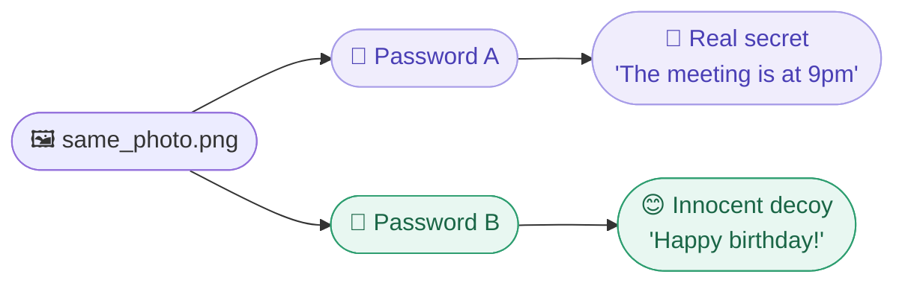
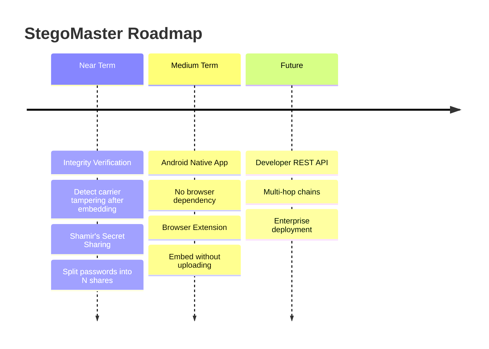

 

 

> **Conceal private messages and files inside ordinary images, audio, videos, and documents.**
> Your carrier looks completely normal. Only your password unlocks the truth.

 

[🌐 **Try It Free**](https://stegomaster.in) &nbsp;·&nbsp; [💰 **Pricing**](https://stegomaster.in/pricing) &nbsp;·&nbsp; [🛡️ **Security**](./SECURITY.md) &nbsp;·&nbsp; [📊 **Benchmarks**](./BENCHMARKS.md) &nbsp;·&nbsp; [🗺️ **Roadmap**](./ROADMAP.md)

---

## 🔍 About

**StegoMaster** is a production-grade **steganography platform** that lets you hide secret messages and files inside ordinary-looking files — images, audio recordings, videos, and documents.

Unlike ordinary encryption (which signals *"something secret is here, try to crack it"*), steganography hides the **existence** of the secret itself. A photo of your morning coffee becomes an encrypted vault. A voice recording becomes a covert channel. A Word document carries hidden intelligence.

> **The secret isn't just locked. It's invisible.**

 

| 🔐 Genuine Security | 👻 Real Invisibility | 🤫 Zero Knowledge |
|:---:|:---:|:---:|
| AES-256-GCM encryption — the same standard trusted by militaries and banks worldwide | Validated against professional steganalysis tools. ~3% of data changed, invisible to the eye | Your password never leaves your device. We store nothing. No database to leak |

---

## ✨ Traditional Encryption vs StegoMaster

 

| | Traditional Encryption | StegoMaster |
|---|:---:|:---:|
| **What attacker sees** | 🔒 An obviously encrypted file | 🖼️ A normal photo or audio file |
| **Attacker reaction** | _"Something is hidden here — let me crack it"_ | _"Nothing to see here"_ |
| **Reveals secret exists?** | ✅ Yes — obviously | ❌ No — completely hidden |
| **Can be forced to decrypt?** | ✅ Yes — only one message | ❌ No — deniable mode has two |
| **Steganalysis detectable?** | N/A | 🟢 Passes all standard tests |

---

## 🔄 How It Works

---

## 📁 Supported Formats

| Format | Hide Text | Hide Files | Quality | Notes |
|:------:|:---------:|:----------:|:-------:|:------|
| 🖼️ **PNG** | ✅ | ✅ | PSNR > 52 dB | Highest capacity, lossless |
| 📷 **JPEG** | ✅ | ✅ | PSNR > 50 dB | Adaptive cost-based embedding |
| 🎵 **WAV** | ✅ | ✅ | Inaudible | Output always lossless |
| 🎶 **MP3 / FLAC / OGG** | ✅ | ✅ | Inaudible | Converted to lossless WAV |
| 🎬 **MP4 / AVI Video** | ✅ | ✅ | Imperceptible | Lossless video codec output |
| 📄 **PDF** | ✅ | ✅ | Invisible | Zero visual change |
| 📝 **Word (.docx)** | ✅ | ✅ | Invisible | Per-word invisible characters |

---

## 🛡️ Security

| ✅ No plaintext at any stage | ✅ Password never transmitted or stored |
|:---:|:---:|
| ✅ Each embedding uses unique cryptographic parameters | ✅ Files auto-deleted after download |

---

## ⭐ Advanced Features

<b>🎭 Deniable Encryption — Two passwords, two messages</b>

 

Hide **two independent messages** in one image using two different passwords.

Under coercion? Hand over Password B. The real secret is cryptographically undetectable.

<b>⏰ Self-Expiring Messages — Auto-delete after time</b>

 

Messages automatically become unreadable after a set time — even with the correct password.

| Duration | Example |
|----------|---------|
| `30s` | 30 seconds |
| `1h` | 1 hour |
| `7d` | 7 days |
| `1month` | 1 month |

<b>💥 Self-Destructing Messages — Single read only</b>

 

| Attempt | Result |
|---------|--------|
| First extraction | ✅ Message received |
| Second extraction | ❌ "No hidden data found" |

<b>📦 File-in-File Hiding — Hide any file type</b>

 

| Carrier | Hidden Content |
|---------|---------------|
| `vacation_photo.png` | `confidential_report.pdf` |
| `voice_note.wav` | `encryption_keys.zip` |
| `presentation.docx` | `source_code.tar.gz` |

---

## 🧪 Steganalysis Validation

StegoMaster has been validated against **7 standard detection methods**:

| Detector | Result | What It Checks |
|:--------:|:------:|:--------------|
| Chi-Square Analysis | 🟢 **SAFE** | Statistical pixel pair balance |
| RS Analysis | 🟢 **SAFE** | Regular-Singular group ratios |
| Sample Pair Analysis | 🟢 **SAFE** | Adjacent pixel statistics |
| Histogram Comparison | 🟢 **SAFE** | Pixel value distribution |
| WS Analysis | 🟢 **SAFE** | Weighted steganography correlation |
| SRM Features | 🟢 **SAFE** | Rich model residual features |
| CNN Simulation | 🟢 **SAFE** | Deep learning feature vectors |

> 📊 See full benchmark results → [BENCHMARKS.md](./BENCHMARKS.md)

---

## 💰 Pricing

|  | 🆓 **Free** | ⚡ **Pro** |
|--|:-----------:|:---------:|
| **Price** | **₹0** forever | **₹199** / month |
| PNG carrier only | ✅ | ✅ All formats |
| Text hiding (10 chars max) | ✅ | ✅ Unlimited |
| AES-256-GCM encryption | ✅ | ✅ |
| File size limit | 15 MB | **100 MB** |
| **File-in-file hiding** | ❌ | ✅ |
| **Self-destruct links** | ❌ | ✅ |
| **Message expiry** | ❌ | ✅ |
| **Deniable encryption** | ❌ | ✅ |
| **Batch processing** | ❌ | ✅ |
| **Genkey / Capacity / Analyze tools** | ❌ | ✅ |
| **Commercial use** | ❌ | ✅ |
| **Priority support** | ❌ | ✅ |
| | [**Start Free →**](https://stegomaster.in) | [**Upgrade →**](https://stegomaster.in/pricing) |

---

## 🎯 Who Uses StegoMaster

| 🕵️ Privacy-First Individuals | 📰 Journalists & Activists |
|:---:|:---:|
| Communicate privately without raising suspicion | Protect sources, transmit sensitive documents through monitored channels |
| **🔬 Security Researchers** | **🏢 Legal & Corporate** |
| Study steganographic techniques against real-world tools | Embed invisible ownership watermarks in creative work |
| **🔑 Secure Backup** | **💻 Developers** |
| Hide credentials inside public cloud images | Integrate covert channels into applications via CLI |

---

## 📈 Development Status

```mermaid
gantt
    title StegoMaster — Feature Completion
    dateFormat  X
    axisFormat  %s%%

    section Production Ready
    Core Encryption Engine      :done, 0, 100
    PNG Steganography            :done, 0, 100
    JPEG Steganography           :done, 0, 100
    Audio Steganography          :done, 0, 100
    Video Steganography          :done, 0, 100
    PDF Steganography            :done, 0, 100
    Document Steganography       :done, 0, 100
    Deniable Encryption          :done, 0, 100
    Web Application              :done, 0, 100
    CLI Tool                     :done, 0, 100

    section Planned
    Android App                  :active, 0, 5
    Browser Extension            :active, 0, 5
```

---

## 🗺️ What's Coming Next

---

## 🤝 Built By

 

Built with ❤️ by **Machchhindra Kalingada** & **Mrunmayee Kalingada**

*"The strongest privacy promise is one we're incapable of breaking."*

 

 

---

**AES-256-GCM · Steganalysis Validated · Zero Storage · Made in India 🇮🇳**

*The best-kept secret is one that no one knows exists.*

